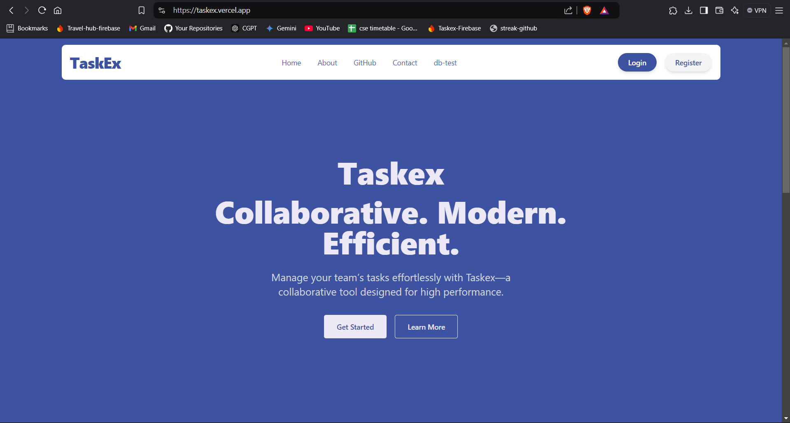
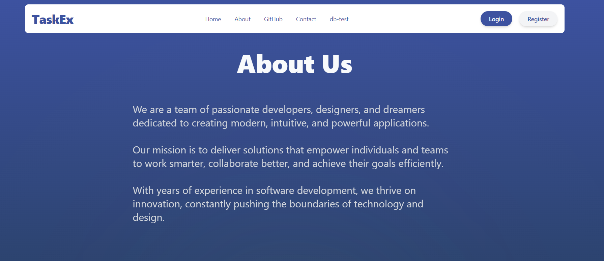
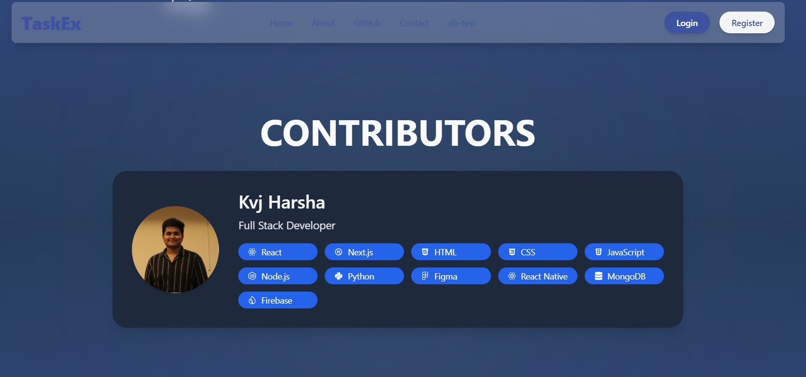
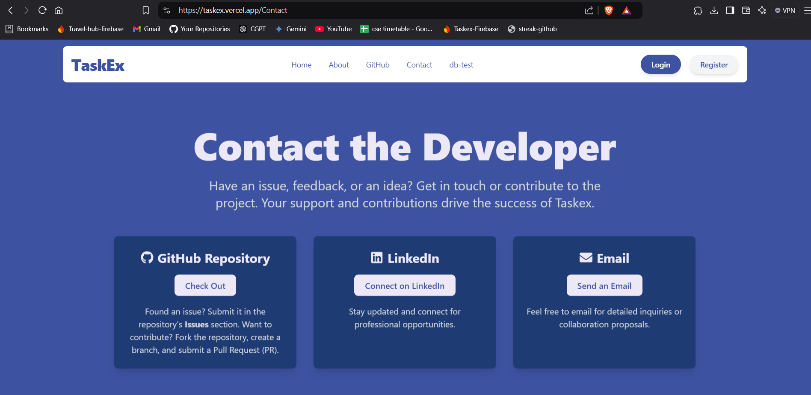
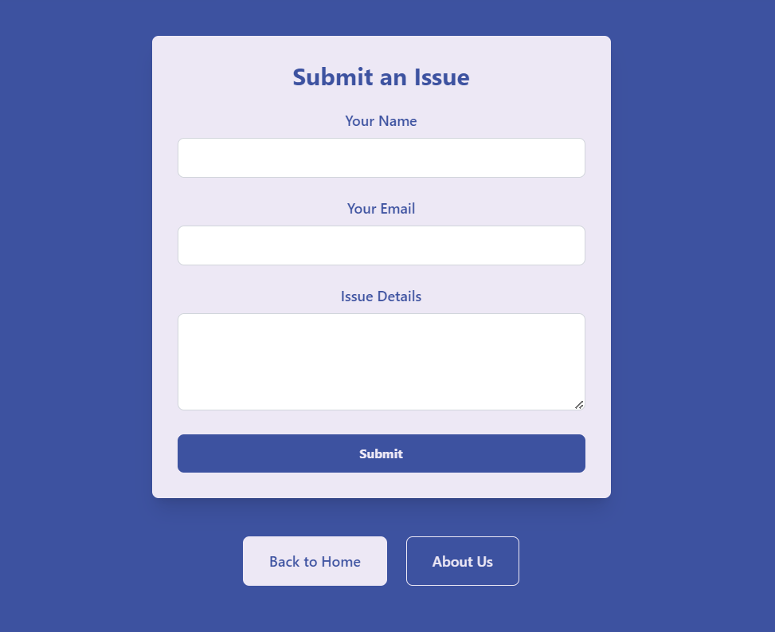
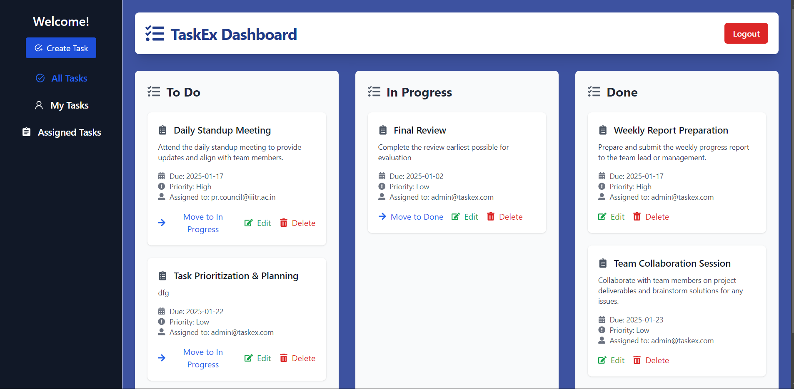
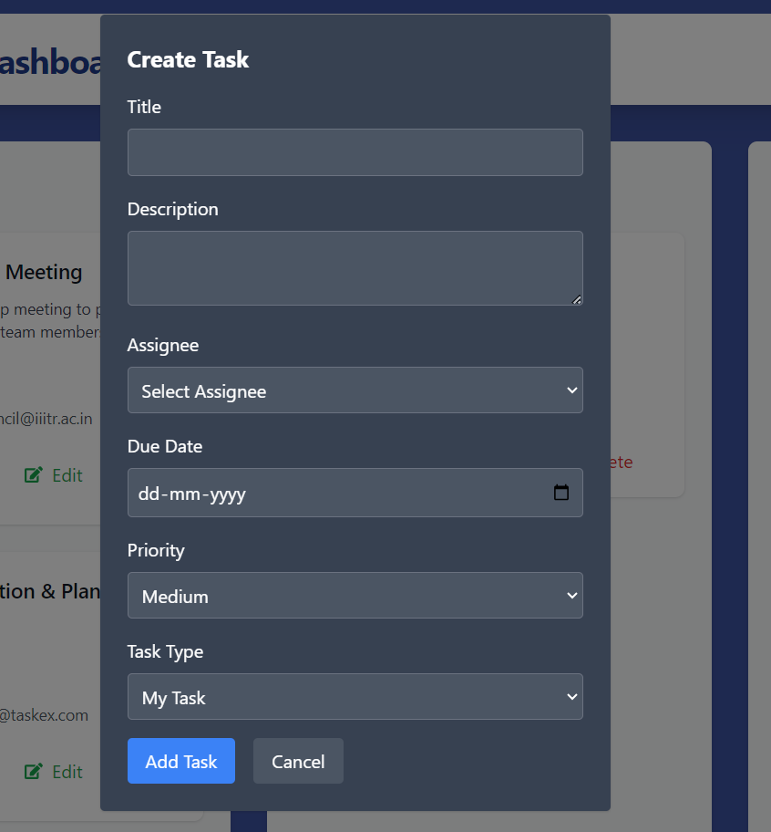
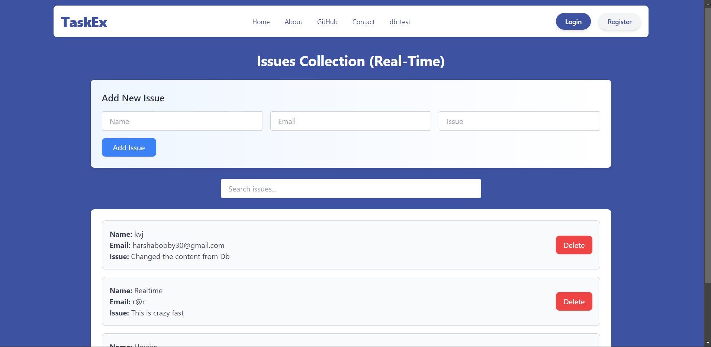

# TaskEx  

Taskex is a task management application built with **Next.js** and **TypeScript**. The project aims to provide an intuitive and efficient solution for managing tasks and boosting productivity.  

## 🚀 Live Demo  
Check out the live version of Taskex here: [taskex.vercel.app](https://taskex.vercel.app)  

## 🛠️ Current Status  
This project is currently in the **implementation stage**. Features are being developed, and the application is not yet production-ready.  

## 🧑‍💻 Tech Stack  
- **Next.js**  
- **TypeScript**  
- **Hyper UI**  
- **Firebase (for Database and Authentication)**  
- **onSnapshot for Real-time Updates**

## ✨ Features
- **Task Management**: Users can assign tasks for personal use or assign tasks to others.  
- **Task States**: Tasks can be categorized into "To-Do", "In Progress", and "Done".  
- **CRUD Operations**: Full Create, Read, Update, and Delete support for tasks.  
- **Real-Time Updates**: Changes are reflected immediately using Firebase's onSnapshot.  
- **Newsletter**: A newsletter form integrated with Firebase.  
- **Issues Form**: Users can report issues through a form connected to Firebase.  

## 🤝 Contributions  
Currently, Taskex is **accepting contributions**. Feel free to fork the repo and submit pull requests for any improvements.  

## ⭐️ Show Your Support  
If you like Taskex, please consider giving it a star!  

## 📄 License  
This project is licensed under the **MIT License**.  

## 📸 Screenshots
Here are 5 ss of Taskex:

1. 
2. 
3. 
4. 
5. 
6. 
7. 
8. 

## 🚀 Getting Started

To get started with Taskex, follow the steps below:

### 1. Clone the Repository
Clone the Taskex repository to your local machine:
```bash
git clone https://github.com/your-username/taskex.git
```

### 2. Install Dependencies
Navigate to the project directory and install the necessary dependencies:
```bash
cd taskex
npm install
```

### 3. Set Up Firebase
To use Firebase for authentication and database, you need to:
- Create a Firebase project in the [Firebase Console](https://console.firebase.google.com/).
- Set up Firebase Authentication (e.g., Email/Password or Google Sign-In).
- Set up Firebase Firestore for real-time database.
- Replace the Firebase config in the project with your own Firebase project credentials.

### 4. Run the Development Server
Once Firebase is configured, you can start the local development server:
```bash
npm run dev
```
The app will be available at [http://localhost:3000](http://localhost:3000).

### 5. Build for Production
To build the app for production, use the following command:
```bash
npm run build
```

### 6. Deploy
You can deploy Taskex to Vercel, Netlify, or any platform that supports Next.js. For example, to deploy with Vercel:
```bash
vercel --prod
```

Let me know if you need additional help setting things up!
